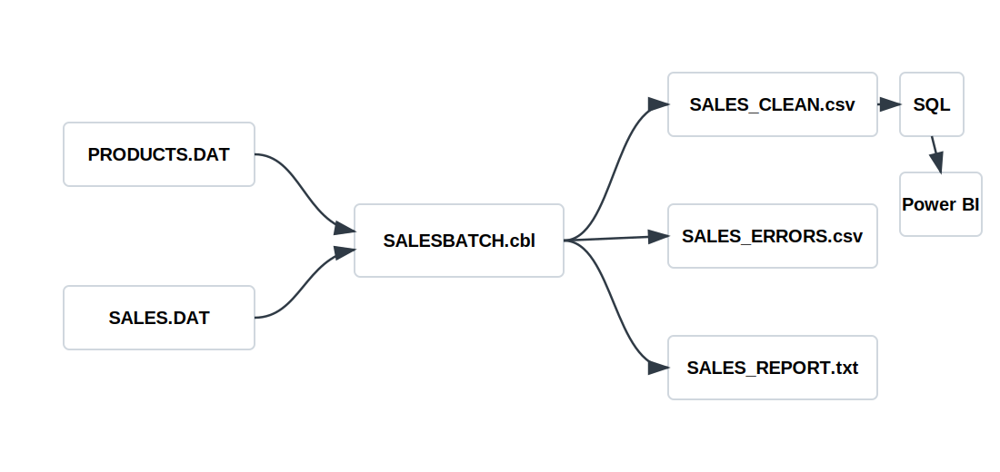

# Legacy Sales Batch Modernization Pipeline

Proceso batch desarrollado en COBOL para leer ventas desde ficheros planos de ancho fijo, validar reglas de negocio, separar registros rechazados y generar una salida limpia para su carga en SQL y posterior analisis en Power BI.

## Descripcion

El proyecto simula un flujo habitual en entornos legacy: recepcion diaria de ventas en fichero plano, ejecucion batch y publicacion de resultados para reporting operativo.

El proceso realiza estas operaciones principales:

1. Carga el maestro de productos.
2. Lee las ventas diarias desde un fichero de ancho fijo.
3. Valida producto, cantidad, fecha y canal de venta.
4. Genera ventas aceptadas, ventas rechazadas e informe de control.

## Flujo



## Estructura del proyecto

```text
legacy-sales-batch-pipeline/
  cobol/
    SALESBATCH.cbl
  copybooks/
    PRODREC.cpy
    SALESREC.cpy
  data/
    input/
      PRODUCTS.DAT
      SALES.DAT
    output/
      SALES_CLEAN.csv
      SALES_ERRORS.csv
      SALES_REPORT.txt
  docs/
    data-layout.md
    jcl-sample.md
    technical-summary.md
  powerbi/
    dashboard-spec.md
  scripts/
    run.ps1
    load_sqlite.ps1
  sql/
    schema.sql
    analytics_queries.sql
```

## Entradas

- `PRODUCTS.DAT`: maestro de productos.
- `SALES.DAT`: ventas diarias en formato de ancho fijo.

## Salidas

- `SALES_CLEAN.csv`: ventas aceptadas, enriquecidas con nombre de producto y categoria.
- `SALES_ERRORS.csv`: ventas rechazadas con el motivo del rechazo.
- `SALES_REPORT.txt`: informe de control de la ejecucion.

## Reglas de validacion

Una venta se acepta solo si cumple estas condiciones:

- El producto existe en el maestro de productos.
- El producto esta activo.
- La cantidad es mayor que cero.
- El canal de venta es `WEB`, `STO` o `APP`.
- La fecha tiene una estructura basica valida `YYYYMMDD`.

## Ejecucion local

Requisitos:

- GnuCOBOL.
- SQLite, opcional para probar la carga SQL local.

Ejecutar el batch COBOL:

```powershell
cd legacy-sales-batch-pipeline
.\scripts\run.ps1
```

Cargar el CSV limpio en SQLite:

```powershell
.\scripts\load_sqlite.ps1
```

## Resultado de ejemplo

```text
Records read:      10
Records accepted:  8
Records rejected:  2
Accepted amount:   4661.00 EUR
```

## Capa de reporting

El fichero `SALES_CLEAN.csv` puede cargarse en SQL y utilizarse desde Power BI. El archivo `powerbi/dashboard-spec.md` describe una propuesta de dashboard con ventas totales, unidades vendidas, distribucion por canal, rendimiento por producto y control de registros rechazados.

## Validacion automatica

El repositorio incluye una accion de GitHub en `.github/workflows/gnucobol.yml`. Al subir el proyecto a GitHub, la accion instala GnuCOBOL en Ubuntu, compila `SALESBATCH.cbl`, ejecuta el proceso batch y comprueba que se generen los ficheros de salida esperados.
